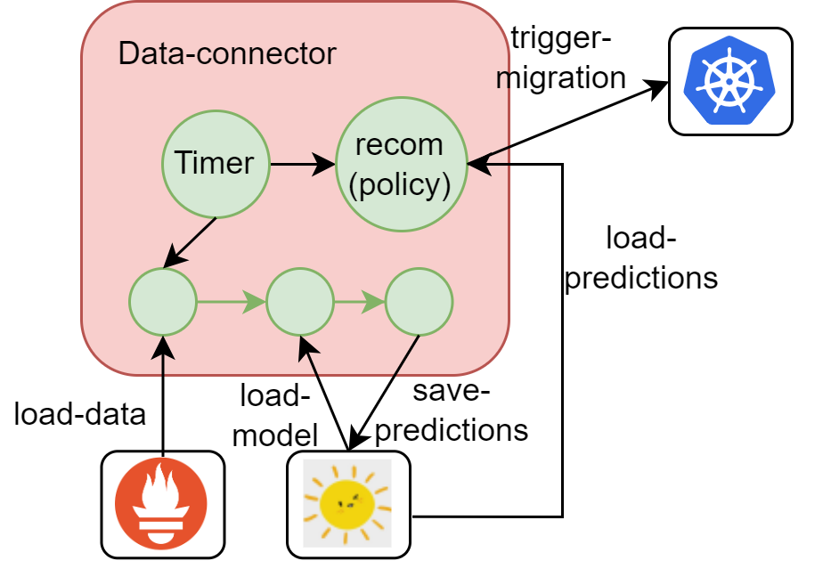

# data-connector

LP agents in charge of providing predictions and recommendations (after modelling), are in the form of data connectors with an API to describe their configuration and their input-outputs.


## data-connector internals



### inference pipeline

The data-connector has the inference pipeline to predict the qos of a given application on all machines. (this pipeline can connect with different models/parameters saved in scanflow)

### recommender

The data-connector has a recommender

- sensor: get the qos predictions and choose the machine id with max_qos
- actuator: trigger at this time k8s to patch the placement of the application deployment.

### timer

The data-connector has a timer

- trigger the pipeline periodically, the qos predictions will be saved to scanflow.
- trigger the recommender periodically to check the qos so that can make actions.

## Results

Here are the log details from the file [log](/examples/cloudedge/target_app_test/run.log):

```
12-Apr-24 10:39:31 -  INFO - Job "watch_qos (trigger: interval[0:05:00], next run at: 2024-04-12 10:44:31 UTC)" executed successfully
12-Apr-24 10:44:31 -  INFO - Running job "watch_qos (trigger: interval[0:05:00], next run at: 2024-04-12 10:49:31 UTC)" (scheduled at 2024-04-12 10:44:31.706882+00:00)
12-Apr-24 10:44:31 -  INFO - Connecting tracking server uri: http://scanflow-tracker.scanflow-cloudedge-dataengineer.svc.cluster.local
12-Apr-24 10:44:31 -  INFO - sensor get runs from experiment_ids: ['2']
12-Apr-24 10:44:31 -  INFO - max_qos 26.652574986958577, index 1
12-Apr-24 10:44:31 -  INFO - agent is patch deployment to node - {'spec': {'template': {'spec': {'nodeSelector': {'kubernetes.io/hostname': 'cloudskin-k8s-worker-1.novalocal'}}}}}
12-Apr-24 10:44:31 -  INFO - update_deployment_with_patch succeeded
12-Apr-24 10:44:31 -  INFO - Job "watch_qos (trigger: interval[0:05:00], next run at: 2024-04-12 10:49:31 UTC)" executed successfully
12-Apr-24 10:49:31 -  INFO - Running job "watch_qos (trigger: interval[0:05:00], next run at: 2024-04-12 10:54:31 UTC)" (scheduled at 2024-04-12 10:49:31.706882+00:00)
12-Apr-24 10:49:31 -  INFO - Connecting tracking server uri: http://scanflow-tracker.scanflow-cloudedge-dataengineer.svc.cluster.local
12-Apr-24 10:49:32 -  INFO - sensor get runs from experiment_ids: ['2']
12-Apr-24 10:49:32 -  INFO - max_qos 29.840644533456956, index 0
12-Apr-24 10:49:32 -  INFO - agent is patch deployment to node - {'spec': {'template': {'spec': {'nodeSelector': {'kubernetes.io/hostname': 'cloudskin-k8s-control-plane-0.novalocal'}}}}}
12-Apr-24 10:49:32 -  INFO - update_deployment_with_patch succeeded
12-Apr-24 10:49:32 -  INFO - Job "watch_qos (trigger: interval[0:05:00], next run at: 2024-04-12 10:54:31 UTC)" executed successfully
12-Apr-24 10:54:31 -  INFO - Running job "watch_qos (trigger: interval[0:05:00], next run at: 2024-04-12 10:59:31 UTC)" (scheduled at 2024-04-12 10:54:31.706882+00:00)
12-Apr-24 10:54:31 -  INFO - Connecting tracking server uri: http://scanflow-tracker.scanflow-cloudedge-dataengineer.svc.cluster.local
12-Apr-24 10:54:31 -  INFO - sensor get runs from experiment_ids: ['2']
12-Apr-24 10:54:31 -  INFO - max_qos 26.67869922509357, index 1
12-Apr-24 10:54:31 -  INFO - agent is patch deployment to node - {'spec': {'template': {'spec': {'nodeSelector': {'kubernetes.io/hostname': 'cloudskin-k8s-worker-1.novalocal'}}}}}
12-Apr-24 10:54:31 -  INFO - update_deployment_with_patch succeeded
```

## Examples

Usage examples can be found in the [tutorials](/tutorials/) folder:

- [Cloudedge Proactive Migration](/tutorials/cloudedge-proactive-migration/): Jupyter Notebooks for Data Engineer and Data Science pipelines tailored for proactive migration recommendation in multi-cluster environments and usage of NearbyOne orchestrator.
  - Code for each involved Scanflow component can be found [here](/examples/cloudedge-proactive-migration/)

- [Cloudedge Reactive Migration](/tutorials/cloudedge-reactive-migration/): Jupyter Notebooks for Data Engineer and Data Science pipelines tailored for reactive app migration recommendation in multi-cluster environments and usage of NearbyOne orchestrator.
  - Code for each involved Scanflow component can be found [here](/examples/cloudedge-reactive-migration/)

## Acknowledgements


CLOUDSKIN has received funding from the European Union’s Horizon research and innovation programme under grant agreement No 101092646.

https://cloudskin.eu
