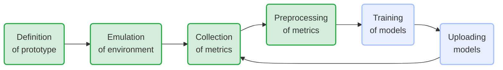
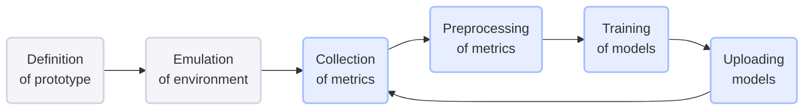

# Cloudskin - Learning Plane

## Description

The learning plane is a conceptual layer in a cloud computing architecture that sits above the control plane. Its primary purpose is to enhance and optimize the operations of the control plane through continuous learning and adaptation. The learning plane leverages data analytics, machine learning (ML), and artificial intelligence (AI) techniques to improve decision-making, automate complex processes, and predict future states of the system.

## Work in Progress

Methodology followed:



On green the finished steps from the workflow.

## Installation

Please use the provided Dockerfile to locally compile the application and test it.

### Requirements

> :warning: TODO: Add any extra requirement needed outside this repository, such as OS packages

## Usage

Configuration will be done through a config json file. As an example:

```json
{
    "preprocessing":{},
    "train":{}
}
```

## Support

You can ask for help in the Slack's [#cloudskin][slack-cloudskin-channel] channel. You can also open issues in this repository.

## Roadmap



## Contributing

### GitFlow convention

Please follow the [GitFlow convention][atlassian-gitflow] to do contributions to the code.

### Linting

Make use of pre-commit git hooks to ensure that the code complies with [PEP8 Style Guide for Python Code][python-pep8-page]. Follow [pre-commit][pre-commit-page] instructions to ensure you have both the pre-commit python package installed and the environment initialized:

```bash
# Install pre-commit package
pip install pre-commit
# Binaries are include in $HOME/.local/bin in Ubuntu
# Ensure that python binaries path are included in the PATH variable
echo 'export PATH="$HOME/.local/bin:$PATH' >> ~/.bashrc
# Close the terminal and open a new one to apply changes or simply reload the .bashrc file
source ~/.bashrc
# Ensure that you have access to the pre-commit binary
pre-commit --version
# Go to the cloned project path and initialize pre-commit with the provided .pre-commit-config.yaml file
cd /path/to/cloudskin-learning-plane
pre-commit install
```

With this, each commit you do will be checked and auto-fixed by the `pre-commit` git hook. You'll have to stage the new changes in the files if something has been fixed.

### Testing

In order to build and launch the test Docker Image:

``` bash
docker build --target test learning-plane:test .
```

``` bash
docker run --rm learning-plane:test

```

## Integrations

Slack integration is configured to send notifications to BSC Data Centric Computing @BSC workspace, in the channel [#cloudsink_ops][slack-cloudskin_ops-channel].

## Authors and acknowledgment

Main author: Joan Oliveras - <joan.oliveras@bsc.es>

Contributors:

* Marc Palacin - <marc.palacin@bsc.es>
* Peini Liu - <peini.liu@bsc.es>

## License

> :warning: TODO: For open source projects, say how it is licensed.

[atlassian-gitflow]: https://www.atlassian.com/git/tutorials/comparing-workflows/gitflow-workflow
[slack-cloudskin_ops-channel]: https://dcc-bsc.slack.com/archives/C063NQX2ZGC
[slack-cloudskin-channel]: https://dcc-bsc.slack.com/archives/C05Q7A90TRB
[python-pep8-page]: https://peps.python.org/pep-0008/
[pre-commit-page]: https://pre-commit.com/
